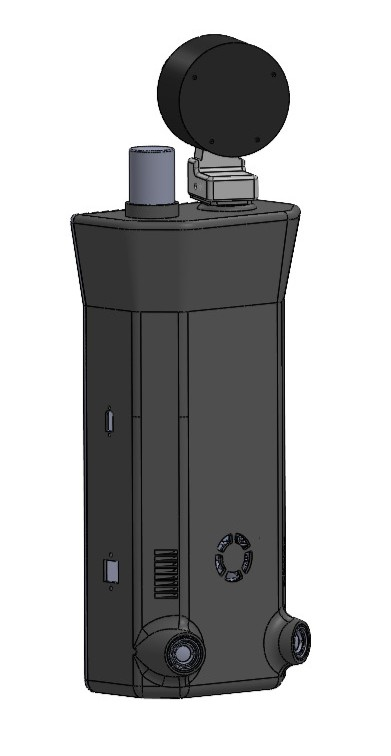
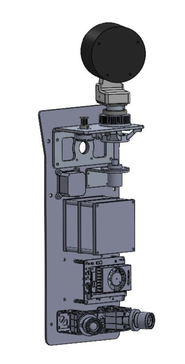
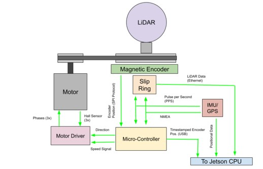
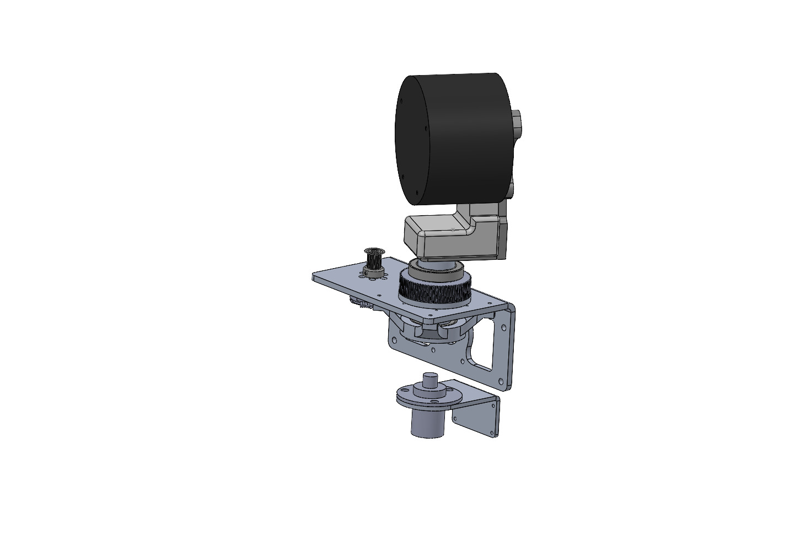
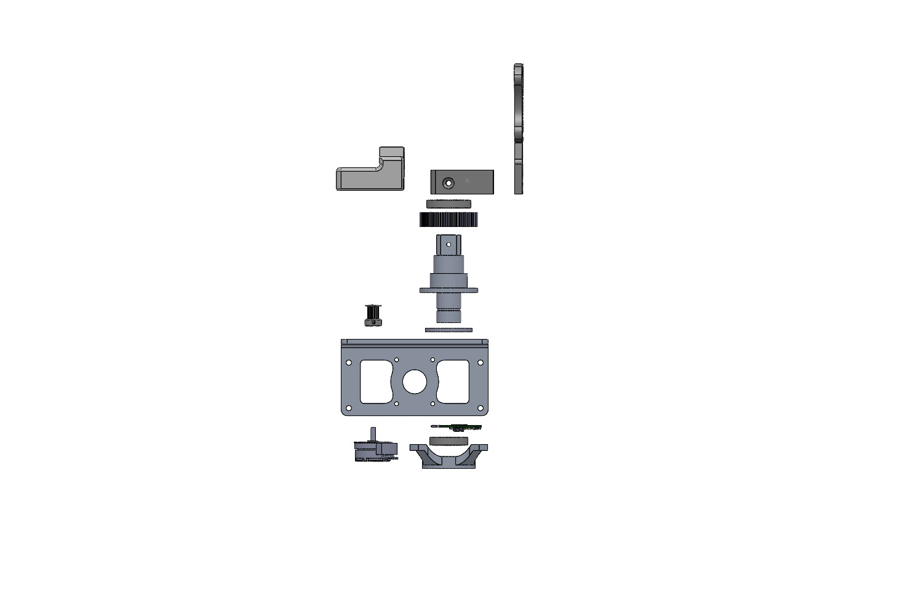
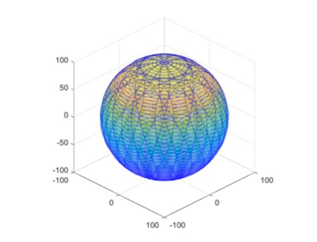

# Forestry Mapping Backpack

<table align="center" width="100%">
  <tr>
    <td align="center" valign="middle" width="50%">
      
       
      <b>Exterior Assembly</b>
    </td>
    <td align="center" valign="middle" width="50%">
      
       
      <b>Interior Assembly</b>
    </td>
  </tr>
</table>

---

## Overview
The LiDAR Backpack Mapping System is a modular mobile sensing platform designed for ecological and forestry data collection. The system integrates a rotating LiDAR sensor, inertial measurement unit (IMU), onboard processing, and custom electronics into a compact, field-deployable package capable of generating high-resolution three-dimensional point clouds. This project encompassed the complete mechanical and electrical design process, including CAD modeling, sheet metal design, custom PCB development, system architecture, MATLAB-based engineering analysis, and structural simulation. The design emphasizes manufacturability, modularity, and ease of assembly while remaining suitable for low-volume fabrication.

---

## Key Features

- Rotating LiDAR platform
- Integrated IMU for spatial orientation
- Modular mechanical architecture
- MATLAB analysis supporting point cloud generation
- Timing belt-driven rotation system
- Custom KiCad PCB
- FEA-validated structural design
- Optimized for low-volume manufacturing

### Project Disclaimer

This project was completed in collaboration with the Purdue Forestry Department. Certain project details, files, and implementation documentation may be limited due to sponsor requirements and intellectual property considerations.

---

## Problem Statement

The Purdue Forestry Department developed a machine learning–based plant recognition system to assist researchers with ecological surveying and vegetation analysis. To improve the usability of the sensing platform during field deployment, the department sought a redesigned LiDAR mounting system that would better support extended hiking through uneven terrain while maintaining high-quality data collection.

The existing system mounted a fixed LiDAR sensor on a tall support mast attached to a backpack frame. While functional, this configuration positioned a significant portion of the system mass away from the user's center of gravity, reducing comfort and stability during long hikes. Additionally, the fixed sensor orientation limited the flexibility of data acquisition and constrained future scanning strategies.

The objective of this project was to design a manufacturable LiDAR mounting system that relocated the sensor closer to the user's center of mass, incorporated a secondary axis of rotation to expand scanning capability, and integrated the required mechanical, electrical, and software subsystems into a compact field-deployable package. The design was intended for low-volume fabrication using conventional manufacturing processes while supporting future prototype construction and validation.

---

## Design Requirements

The following design requirements were established during the concept development phase to guide system architecture and engineering decisions. Requirements were selected to balance field usability, sensing performance, manufacturability, and compatibility with the existing Purdue Forestry Department backpack platform.

### Mechanical Requirements

| ID | Requirement | Target | Verification Method |
|----|-------------|--------|---------------------|
| DR-01 | Total system weight | < 5 kg (excluding backpack) | CAD mass properties |
| DR-02 | Structural durability | Withstand 5 g loading without structural failure | Finite Element Analysis (FEA) |
| DR-03 | Manufacturability | Components shall be manufacturable using conventional CNC machining, sheet metal fabrication, additive manufacturing, and commercially available hardware | Design review and manufacturing drawings |
| DR-04 | Serviceability | Electronics and wearable components shall be removable without permanent modification to the assembly | Assembly review |

### Functional Requirements

| ID | Requirement | Target | Verification Method |
|----|-------------|--------|---------------------|
| FR-01 | Point cloud coverage | Provide 360° scanning with a secondary axis of rotation to improve spatial coverage and reduce occlusions | MATLAB analysis and future field validation |
| FR-02 | Rotational position tracking | Report motor position to ±0.01° for point cloud reconstruction | Encoder specification and software verification |

### Integration Requirements

| ID | Requirement | Target | Verification Method |
|----|-------------|--------|---------------------|
| IR-01 | Backpack compatibility | Integrate with the existing Purdue Forestry backpack frame, 24 V hot-swappable M18 battery system, and existing data interfaces | CAD integration and electrical design review |
| IR-02 | Environmental protection | Minimum enclosure protection equivalent to IP32 | Enclosure design review and future ingress testing |

---

## System Architecture

The LiDAR Backpack Mapping System was designed as a modular mechatronic platform integrating sensing, motion control, power management, and onboard computation. The system architecture was developed to allow independent development and maintenance of each subsystem while maintaining compatibility with the existing Purdue Forestry Department backpack platform.

The system is composed of four primary subsystems:

1. **Sensing System** — LiDAR and IMU sensors responsible for collecting spatial and orientation data.
2. **Motion Control System** — Motor, encoder, and controller responsible for rotating the LiDAR sensor and providing rotational position feedback.
3. **Power Distribution System** — Battery, voltage regulation, and protection circuitry responsible for supplying power to all electrical components.
4. **Processing and Data System** — Embedded computing platform responsible for sensor communication, data synchronization, and point cloud generation.

  

### Sensing System

The sensing subsystem consists of an Ouster OS1 LiDAR sensor paired with an Ellipse N inertial measurement unit (IMU). The LiDAR provides high-resolution three-dimensional measurements, while the IMU provides time synchronization and orientation information required for accurate spatial reconstruction. Combining LiDAR measurements with rotational position feedback enables the generation of a complete point cloud from the scanning platform.

### Motion Control System

The motion control subsystem provides controlled rotation of the LiDAR assembly through a motor-driven mechanism. A geared timing belt transmission was selected to ensure stable torque transmission during operation. Encoder feedback is used to track rotational position and synchronize the scanning motion with collected sensor data.

### Power Distribution System

The system operates using a 24 V hot-swappable battery architecture inherited from the existing backpack platform. Power is distributed to the LiDAR, motor controller, embedded electronics, and onboard computer through dedicated power regulation and distribution hardware.

### Processing and Data System

The processing subsystem uses an NVIDIA Jetson Orin platform to collect sensor data, synchronize measurements, and generate three-dimensional point clouds. Communication between the LiDAR, IMU, motor controller, and processing hardware was designed to maintain reliable data transfer while minimizing external wiring.

---

## Mechanical Design

<table border="0" cellpadding="10" cellspacing="0" width="100%">
  <tr>
    <td width="10%" align="center" valign="middle">
      
    </td>
    <td width="55%" valign="middle">
      
The mechanical design of the LiDAR Backpack Mapping System focused on creating a compact, modular, and manufacturable platform capable of integrating the sensing, motion, and electrical subsystems while remaining compatible with the existing Purdue Forestry backpack. Key design objectives included reducing the sensor offset from the user's center of mass, incorporating a secondary axis of rotation, protecting sensitive electronics, and simplifying assembly and maintenance.

    </td>
  </tr>
</table>

### System Packaging

The system was designed around a modular architecture consisting of 3 primary mechanical assemblies:

- Backpack mounting interface
- Rotating LiDAR platform
- Electronics enclosure

Separating these functions into individual assemblies allows components to be serviced, modified, or replaced without requiring complete disassembly of the platform. The modular approach also supports future upgrades and simplifies manufacturing.

### Rotational Drive System

A motor-driven timing belt transmission was selected to rotate the LiDAR assembly while satisfying the rotational velocity requirements established through MATLAB analysis. A T2 timing belt system was chosen due to its compact packaging, reliable torque transmission, and availability of commercially available components.

The drivetrain utilizes a 15-tooth driving pulley and a 75-tooth driven pulley, producing a 5:1 reduction ratio. This configuration increases available output torque while achieving the rotational speed required for point cloud generation. Transmission geometry, including pulley spacing and belt length, was determined through analytical calculations to ensure proper belt engagement and reliable operation.

  
   
  <em>Rotational Drive System Assembly</em>

  
<b>📐 View Exploded CAD Assembly</b>

   
  

    
     
    <em>Exploded Assembly showcasing the T2 timing belt drivetrain, bearings, and custom motor mount.</em>
  

### Structural Design

The structural frame was designed to support the rotating LiDAR assembly while maintaining stiffness and minimizing unnecessary weight. Particular attention was given to the alignment of rotating components, load paths between the backpack interface and drive system, and accessibility for assembly.

Mechanical interfaces were designed using commercially available bearings, fasteners, and drivetrain components to reduce manufacturing complexity and improve long-term maintainability.

### Electronics Packaging

The enclosure was designed to protect the custom electronics while providing convenient access for assembly, maintenance, and future upgrades. Internal packaging considered component accessibility, cable routing, connector placement, and integration with the rotating assembly.

The enclosure architecture allows the sensing, control, and power subsystems to be integrated into a compact package while reducing exposed wiring during field operation.

### Design for Manufacturing

The mechanical system was developed with low-volume manufacturing in mind. Components were designed around conventional fabrication methods including CNC machining, sheet metal fabrication, and additive manufacturing. Standard hardware was incorporated wherever practical to minimize custom fabrication requirements and simplify procurement.

Critical functional interfaces were designed for repeatable assembly and would be fully defined through manufacturing drawings and GD&T prior to fabrication. The resulting design provides a practical balance between manufacturability, structural performance, and ease of maintenance.

---

## Electrical Design

---

## Software Architecture

  

<blockquote>
  

    <strong>💻 Embedded Software & Control Loop documentation coming soon.</strong> 
    This section will document the C++ firmware running on the microcontroller, including the closed-loop PID velocity control for the secondary axis motor, encoder feedback processing, and signal routing.
  

</blockquote>

---

## Engineering Analysis

Engineering analysis was used to establish design parameters and validate critical system decisions. The analysis process began by evaluating the relationship between LiDAR measurement characteristics and scanning motion, which informed the required rotational velocity of the system. Mechanical drive calculations were then performed to select an appropriate transmission design, followed by structural analysis of the final assembly.

### MATLAB Scanning Analysis
A MATLAB model was developed to simulate the point cloud generated by a LiDAR unit rotating about two independent axes. The objective of the analysis was to determine the external rotational frequency required to achieve complete and uniform point cloud coverage from a stationary position.

The LiDAR's internal emitter operates at a rotational frequency of 10 Hz. Because the LiDAR was mounted on a secondary rotating axis, the relationship between the internal scan frequency and the external rotational frequency directly influences point cloud density and spatial coverage. Selecting an external rotational frequency that is an integer factor or multiple of the internal 10 Hz scan frequency results in periodic overlap of the scan pattern, producing incomplete coverage and gaps within the reconstructed point cloud.

Multiple external rotational frequencies were evaluated using the MATLAB model. Simulation results demonstrated that secondary axis rotational frequencies of **3 Hz** and **7 Hz** produced the most uniform point cloud distribution while minimizing repeated scan paths. Based on these results, the external rotational speed requirement for the mechanical drive system was established.

  
   
  <em>MATLAB Simulation showing point cloud coverage density over a 360-degree sweep at a 2.0 RPM target secondary axis speed</em>

The complete simulation script used to model the scanning spatial density can be accessed here:
👉 **[LiDAR_CoverageArea.m](Analysis%20%26%20Code/LiDAR_CoverageArea.m)**

### Rotation System and Gear Design

The rotational axis was designed to provide controlled motion of the LiDAR assembly while satisfying the rotational velocity requirements established through MATLAB scanning analysis. The drivetrain design focused on selecting a reliable transmission method that could provide the required speed reduction, torque capacity, and compact packaging.

A T2 timing belt system was selected due to its suitability for compact motion transmission and availability of standardized pulley components. Based on manufacturer recommendations, the design targeted a 5:1 reduction ratio to balance torque multiplication, rotational speed, and reliable belt engagement.

The drivetrain geometry was developed from the selected motor pulley. The driven pulley size was calculated based on the required reduction ratio, and the resulting center-to-center spacing and belt length were determined to ensure proper belt fit and operation.

Key calculations included:

- Driven pulley sizing based on required gear ratio
- Pulley center separation distance
- Required timing belt length
- Rotational velocity after reduction
- Torque required to rotate the LiDAR assembly
- Motor startup torque under load conditions

The final transmission design provided the required rotational speed while maintaining sufficient torque capacity to rotate the LiDAR assembly and associated mechanical components.

<!-- Insert timing belt sketch/calculations here -->

<!-- Insert drivetrain CAD image here -->

### Structural Analysis (FEA)

  

<blockquote>
  

    <strong>📊 Finite Element Analysis (FEA) coming soon.</strong> 
    Currently setting up structural simulations in ANSYS to evaluate stress concentrations, safety margins, and structural displacement under dynamic load conditions for the custom mounting bracketry.
  

</blockquote>

---

## Design for Manufacturing

The LiDAR Backpack Mapping System was designed with low-volume fabrication in mind. While the system was developed as a research prototype, the mechanical architecture prioritized manufacturability, accessibility of components, and ease of assembly using processes available to small-scale fabrication shops.

### Manufacturing Approach

The design utilizes a combination of conventional manufacturing methods, including CNC machining, sheet metal fabrication, additive manufacturing, and commercially available hardware. Manufacturing processes were selected based on part function, required precision, and cost considerations.

Critical structural and alignment features were designed around machinable interfaces, while non-critical components were designed to reduce manufacturing complexity and allow rapid iteration.

### Component Selection

Commercially available components were incorporated where possible to reduce custom fabrication requirements. Examples include:

- Timing belt and pulley components
- Bearings
- Fasteners
- Motor and encoder hardware
- Electrical connectors

Using standardized components reduces lead times, simplifies replacement, and improves long-term serviceability.

### Assembly and Serviceability

The system was designed as a modular assembly with separate mechanical, electrical, and sensing components. This approach allows individual subsystems to be accessed, replaced, or modified without requiring complete disassembly of the platform.

Design considerations included:

- Accessible fasteners
- Modular enclosure design
- Cable routing considerations
- Separation of structural and electronic components

### Future Manufacturing Considerations

If transitioned from prototype design to production, additional engineering documentation would be developed, including detailed manufacturing drawings, tolerance specifications, and GD&T on critical interfaces.

Potential future manufacturing validation would include:

- Fabrication of prototype components
- Assembly verification
- Dimensional inspection
- Structural testing

---

## Project Status

The LiDAR Backpack Mapping System was developed as part of a senior design project in collaboration with the Purdue Forestry Department. The project progressed through multiple design iterations, beginning with the development of a benchmark system and continuing toward a fully integrated field-deployable platform.

### Benchmark System

An initial benchmark system was developed by the senior design team to provide a functional platform for evaluating the plant recognition workflow. This system utilized lower-grade electronics and a simplified mounting approach that allowed it to be installed on the existing backpack platform.

The benchmark system established a baseline hardware configuration and provided a foundation for future development. Further validation of the benchmark system with the plant recognition algorithm is planned.

### Integrated System Design

The current iteration focuses on integrating the complete sensing, motion, power, and processing architecture into a single manufacturable platform. The detailed design phase has been completed, including:

- Mechanical system design
- Sensor and hardware integration
- Electrical architecture development
- Motion system analysis
- MATLAB-based scanning analysis
- Manufacturing considerations

The system is currently at the fabrication-ready stage. Fabrication and physical validation will proceed upon sponsor approval and project continuation.

---

## Future Work

The next phase of development would focus on fabrication, system integration, and validation of the completed design. Future work would transition the system from a fabrication-ready design into a fully tested field deployment platform.

### Prototype Fabrication and Integration

Future work would begin with fabrication and assembly of the redesigned LiDAR platform. This phase would include the integration of the mechanical assembly, electrical hardware, sensing components, and onboard processing system.

Planned integration tasks include:

- Fabrication of mechanical components
- Assembly of the rotating LiDAR mechanism
- Integration of sensors, motor controller, and electronics
- Verification of mechanical and electrical interfaces

#### Mechanical Validation

Testing would include:

- **Weight validation:** Confirm total system mass meets the design requirement.
- **Drop testing:** Evaluate structural durability and ensure components remain functional after accidental impacts.
- **Backpack mobility testing:** Evaluate system usability during normal hiking conditions and verify that the updated mounting configuration improves integration with the backpack platform.

#### Environmental Validation

The enclosure and hardware protection would be evaluated through:

- Weather exposure testing
- Verification of enclosure protection against environmental conditions
- Confirmation that internal electronics remain protected during field operation

#### Data Collection and Algorithm Validation

The sensing system would be evaluated through field data collection tests, including:

- **Wall test:** Walking the backpack along a controlled surface to evaluate point cloud consistency and rotational accuracy.
- Validation of LiDAR point cloud generation with the plant recognition algorithm.
- Evaluation of sensor synchronization and positional tracking accuracy.

#### Electrical Validation

Electrical integration testing would verify:

- Stable power delivery from the existing 24 V battery system
- Reliable communication between sensors, motor controller, and processing hardware
- Continuous operation of the motor and sensing systems during data collection

### Future Hardware Improvements

Additional hardware improvements identified during the design process include:

- Replacing the Arduino Nano-based control system with an STM32 microcontroller to improve processing capability, communication flexibility, and future expandability.
- Consolidating the current distributed PCB architecture into a single integrated interface board to reduce wiring complexity, improve reliability, and simplify assembly.

---

## Skills Demonstrated

### Mechanical Design
- SolidWorks CAD modeling and assembly design
- Mechanical packaging and system integration
- Timing belt transmission design and gear ratio calculations
- Structural design considerations for field-deployed hardware
- Design for manufacturing (CNC machining, sheet metal fabrication, additive manufacturing)
- Modular assembly and serviceability considerations

### Electrical and Embedded Systems
- System-level electrical architecture development
- Power distribution and hardware integration
- Sensor and actuator interfacing
- PCB system design using KiCad
- Embedded controller integration and communication planning

### Robotics and Sensing Systems
- LiDAR-based 3D mapping systems
- IMU integration and orientation tracking
- Encoder-based position feedback systems
- Sensor synchronization concepts
- Point cloud generation and processing workflows

### Engineering Analysis
- MATLAB-based system modeling and scanning analysis
- Rotational velocity optimization
- Mechanical drivetrain calculations
- Torque and load analysis
- Finite Element Analysis 

### Engineering Tools
- SolidWorks
- KiCad
- MATLAB
- ANSYS Mechanical
- Python
- Git/GitHub
- Technical documentation and engineering communication

---

## Acknowledgments

This project was completed in collaboration with the Purdue Forestry Department as part of a senior design project focused on improving field deployment of plant recognition and LiDAR mapping systems.

Special thanks to **Evan Flatt, Purdue Forestry Department**, for sponsoring the project, providing the application requirements, domain knowledge, and guidance that informed the system design.

The initial benchmark platform was developed from an existing legacy system and served as the foundation for subsequent design iterations. The integrated LiDAR mapping platform presented in this portfolio represents the continued development of that system, including the mechanical redesign, system architecture, drivetrain analysis, and integration planning.

Additional contributions from team members are acknowledged where applicable, including assistance with software development and specific CAD contributions.

---

## References

